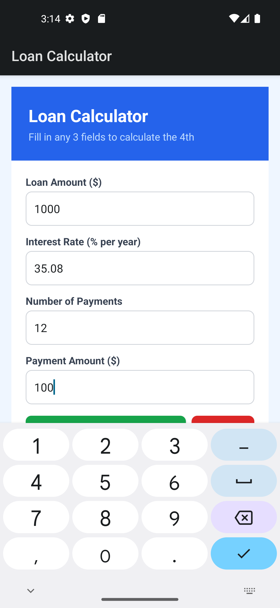
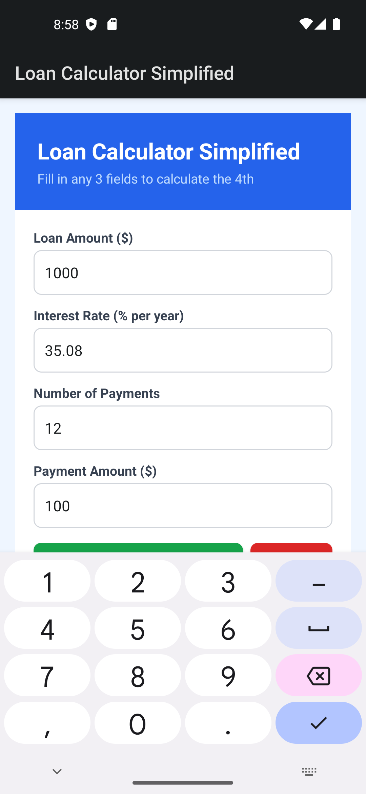

# Loan Calculator Simplified

A cross-platform loan calculator with PIN authentication, built natively for Android and iOS.

Enter any 3 of the 4 loan variables and the app solves for the missing one:

- **Loan Amount**
- **Interest Rate** (annual %)
- **Number of Payments**
- **Payment Amount**

Results include the calculated value, total amount paid, and total interest paid.

## Platforms

### Android

Built with C# and .NET 8 (`net8.0-android`). Uses native Android views and Activities.

- `LoginActivity` &mdash; 4-digit PIN setup/entry with SHA-256 hashing (SharedPreferences)
- `MainActivity` &mdash; Loan calculator with solve-for-any-field logic

**Requirements:** Visual Studio 2022+ with the .NET MAUI / Android workload, or `dotnet build` with the Android SDK.

```
dotnet build loancalculatorsimplified.sln
```

### iOS

Built with SwiftUI (iOS 16+). Uses a clean Models/Views/Services architecture with Keychain-backed PIN storage.

See [`ios/README.md`](ios/README.md) for full details.

**Requirements:** macOS with Xcode 15+.

## Project Structure

```
loancalculatorsimplified/
├── loancalculatorsimplified.sln              # .NET solution (Android)
├── loancalculatorsimplified/                 # Android project
│   ├── loancalculatorsimplified.csproj
│   ├── AndroidManifest.xml
│   ├── LoginActivity.cs
│   ├── MainActivity.cs
│   └── Resources/
├── ios/                                      # iOS project
│   ├── loancalculatorsimplified.xcodeproj/
│   └── loancalculatorsimplified/
│       ├── Models/LoanCalculation.swift
│       ├── Views/LoginView.swift
│       ├── Views/CalculatorView.swift
│       └── Services/AuthenticationService.swift
└── LoanCalc_Icon.png                        # App icon
```

## Screenshots

| Android | PIN Login |
|---------|-----------|
|  |  |

## Bundle ID

`com.loancalcsimplified.app` (shared across both platforms)
